# Execution Plan

## Detailed Analysis Summary

### Project Context

- **Project Type**: Greenfield
- **Lifecycle Focus**: Inception成果物を審査品質まで引き上げ、後続でMVP実装へ進める
- **Primary Intent**: 先延ばしを肯定しつつ、破綻しないギリギリの開始判断を支援する
- **Theme**: 人をダメにするサービス

### Change Impact Assessment

- **User-facing changes**: Yes
  - 新規Webアプリとして、タスク入力、最遅着手時刻表示、リスク帯、サボってよい時間、言い訳生成を提供する。
- **Structural changes**: Yes
  - Webフロントエンド、軽量API、簡易DB、LLM補助、フォールバック推定を含む新規構成が必要。
- **Data model changes**: Yes
  - タスク、推定結果、履歴、達成/失敗結果、言い訳生成履歴のデータ定義が必要。
- **API changes**: Yes
  - MVP実装ではタスク登録、推定、履歴保存、言い訳生成のAPI候補が必要。
- **NFR impact**: Yes
  - LLM失敗時のフォールバック、推定の説明性、PBT部分適用、AWSデプロイしやすい構成が必要。

### Risk Assessment

- **Risk Level**: Medium
- **Rollback Complexity**: Easy for documentation, moderate for later implementation
- **Testing Complexity**: Moderate
- **Main Risks**:
  - LLM利用が外部AI強依存に見えるリスク
  - 普通のタスク管理アプリに見えるリスク
  - Unit分解が技術単位だけに寄り、テーマ価値が薄くなるリスク
  - 言い訳生成が悪ふざけだけに見えるリスク

### Mitigation

- LLMはMVPに含めるが、フォールバック推定を設計の中核に含める。
- Application Designでは、CRUDではなく独自コンポーネントを中心にする。
- Units Generationでは、能力単位と実装単位を併記する。
- 各Unitに「人をダメにする効果」と「ビジネス価値」を必ず含める。

## Workflow Visualization

### Mermaid Diagram

```mermaid
flowchart TD
    Start(["User Request"])

    subgraph Inception["INCEPTION PHASE"]
        WD["Workspace Detection<br/><b>COMPLETED</b>"]
        RE["Reverse Engineering<br/><b>SKIP</b>"]
        RA["Requirements Analysis<br/><b>COMPLETED</b>"]
        US["User Stories<br/><b>COMPLETED</b>"]
        WP["Workflow Planning<br/><b>COMPLETED</b>"]
        AD["Application Design<br/><b>EXECUTE</b>"]
        UG["Units Generation<br/><b>EXECUTE</b>"]
    end

    subgraph Construction["CONSTRUCTION PHASE"]
        FD["Functional Design<br/><b>EXECUTE</b>"]
        NFRA["NFR Requirements<br/><b>EXECUTE</b>"]
        NFRD["NFR Design<br/><b>EXECUTE</b>"]
        ID["Infrastructure Design<br/><b>EXECUTE</b>"]
        CG["Code Generation<br/><b>EXECUTE</b>"]
        BT["Build and Test<br/><b>EXECUTE</b>"]
    end

    subgraph Operations["OPERATIONS PHASE"]
        OPS["Operations<br/><b>PLACEHOLDER</b>"]
    end

    Start --> WD
    WD --> RE
    RE --> RA
    RA --> US
    US --> WP
    WP --> AD
    AD --> UG
    UG --> FD
    FD --> NFRA
    NFRA --> NFRD
    NFRD --> ID
    ID --> CG
    CG --> BT
    BT --> OPS
    OPS --> End(["Complete"])

    style WD fill:#4CAF50,stroke:#1B5E20,stroke-width:3px,color:#fff
    style RA fill:#4CAF50,stroke:#1B5E20,stroke-width:3px,color:#fff
    style US fill:#4CAF50,stroke:#1B5E20,stroke-width:3px,color:#fff
    style WP fill:#4CAF50,stroke:#1B5E20,stroke-width:3px,color:#fff
    style RE fill:#BDBDBD,stroke:#424242,stroke-width:2px,stroke-dasharray: 5 5,color:#000
    style AD fill:#FFA726,stroke:#E65100,stroke-width:3px,stroke-dasharray: 5 5,color:#000
    style UG fill:#FFA726,stroke:#E65100,stroke-width:3px,stroke-dasharray: 5 5,color:#000
    style FD fill:#FFA726,stroke:#E65100,stroke-width:3px,stroke-dasharray: 5 5,color:#000
    style NFRA fill:#FFA726,stroke:#E65100,stroke-width:3px,stroke-dasharray: 5 5,color:#000
    style NFRD fill:#FFA726,stroke:#E65100,stroke-width:3px,stroke-dasharray: 5 5,color:#000
    style ID fill:#FFA726,stroke:#E65100,stroke-width:3px,stroke-dasharray: 5 5,color:#000
    style CG fill:#4CAF50,stroke:#1B5E20,stroke-width:3px,color:#fff
    style BT fill:#4CAF50,stroke:#1B5E20,stroke-width:3px,color:#fff
    style OPS fill:#BDBDBD,stroke:#424242,stroke-width:2px,stroke-dasharray: 5 5,color:#000
    style Start fill:#CE93D8,stroke:#6A1B9A,stroke-width:3px,color:#000
    style End fill:#CE93D8,stroke:#6A1B9A,stroke-width:3px,color:#000
    style Inception fill:#BBDEFB,stroke:#1565C0,stroke-width:3px,color:#000
    style Construction fill:#C8E6C9,stroke:#2E7D32,stroke-width:3px,color:#000
    style Operations fill:#FFF59D,stroke:#F57F17,stroke-width:3px,color:#000
    linkStyle default stroke:#333,stroke-width:2px
```



### Text Alternative

```text
INCEPTION
- Workspace Detection: COMPLETED
- Reverse Engineering: SKIP
- Requirements Analysis: COMPLETED
- User Stories: COMPLETED
- Workflow Planning: COMPLETED
- Application Design: EXECUTE
- Units Generation: EXECUTE

CONSTRUCTION
- Functional Design: EXECUTE
- NFR Requirements: EXECUTE
- NFR Design: EXECUTE
- Infrastructure Design: EXECUTE
- Code Generation: EXECUTE
- Build and Test: EXECUTE

OPERATIONS
- Operations: PLACEHOLDER
```

## Phases to Execute

### INCEPTION PHASE

- [x] Workspace Detection - COMPLETED
  - **Rationale**: Greenfield workspace and rule details directory were identified.
- [x] Reverse Engineering - SKIPPED
  - **Rationale**: Existing application code was not detected.
- [x] Requirements Analysis - COMPLETED
  - **Rationale**: Intent, MVP scope, LLM policy, PBT partial enforcement, and acceptance criteria were defined.
- [x] User Stories - COMPLETED
  - **Rationale**: User-facing psychological experience required personas and acceptance criteria.
- [x] Workflow Planning - COMPLETED
  - **Rationale**: Execution path is now documented.
- [ ] Application Design - EXECUTE
  - **Rationale**: New components and service boundaries are needed. Design must emphasize unique components such as Procrastination Deadline Engine, Guilt-Free Idle Planner, Excuse Generator, and Self-Deception History.
- [ ] Units Generation - EXECUTE
  - **Rationale**: Unit decomposition is a judging criterion. Units must be organized by capability and implementation responsibility, not only UI/API/DB layers.

### CONSTRUCTION PHASE

- [ ] Functional Design - EXECUTE
  - **Rationale**: The estimation engine, risk band logic, fallback behavior, and history-based correction require detailed business rules.
- [ ] NFR Requirements - EXECUTE
  - **Rationale**: LLM reliability, explainability, PBT partial enforcement, usability, and deployability require explicit NFR treatment.
- [ ] NFR Design - EXECUTE
  - **Rationale**: NFR patterns must be incorporated into component design, especially fallback behavior and testability.
- [ ] Infrastructure Design - EXECUTE
  - **Rationale**: The target path includes AWS deployment. MVP uses lightweight API and DB, but infrastructure mapping should remain deployable.
- [ ] Code Generation - EXECUTE
  - **Rationale**: Always required for implementation.
- [ ] Build and Test - EXECUTE
  - **Rationale**: Always required for build, unit tests, integration tests, PBT where applicable, and demo verification.

### OPERATIONS PHASE

- [ ] Operations - PLACEHOLDER
  - **Rationale**: AI-DLC Operations stage is currently a placeholder.

## Recommended Capability Sequence

1. **Procrastination Deadline Engine**
   - Defines latest start time, success probability, and risk band logic.
2. **Workload Estimation**
   - Defines LLM-assisted estimation and rule-based fallback.
3. **Guilt-Free Idle Planner**
   - Defines the visible "allowed procrastination" experience.
4. **Excuse Generator**
   - Defines the theme-forward failure and excuse experience.
5. **Self-Deception History**
   - Defines persistence, outcome tracking, and later personalization.
6. **Task Intake and Demo Flow**
   - Defines the minimal-input UX and end-to-end MVP demo path.

## Estimated Timeline

- **Remaining Inception Stages**: 2
- **Construction Stages**: 6
- **Detail Level**: Standard to comprehensive for Inception, focused for MVP construction

## Success Criteria

- **Primary Goal**: Create Inception artifacts that clearly explain intent, theme fit, user stories, application components, and unit decomposition.
- **Key Deliverables**:
  - Application Design with distinctive components
  - Units Generation with capability-based and implementation-based mapping
  - Construction-ready plan for MVP implementation
- **Quality Gates**:
  - Every major component explains how it makes the user worse and why it still has business value.
  - Every unit maps to user stories, capabilities, screens/API/data, and MVP scope.
  - LLM usage is not a hard dependency for the core demo.
  - PBT partial requirements carry forward to design and code stages.

## Extension Rule Compliance

| Extension | Status | Rationale |
|---|---|---|
| Security Baseline | Skipped | Disabled in Requirements Analysis. |
| Property-Based Testing | N/A | Workflow Planning does not define code/tests, but plan carries PBT partial requirements into later design and code stages. |
